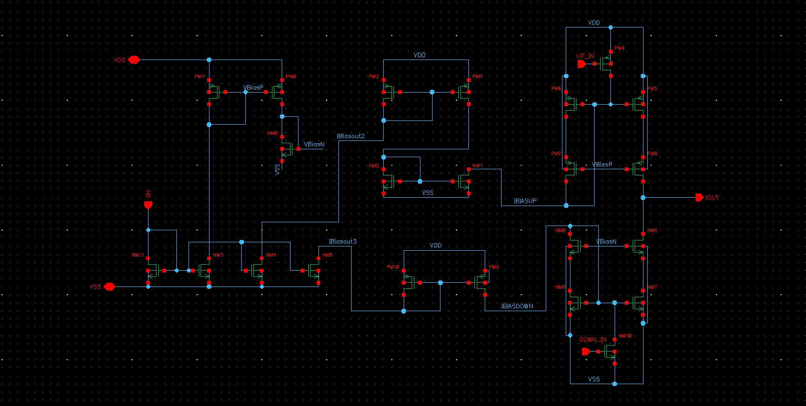
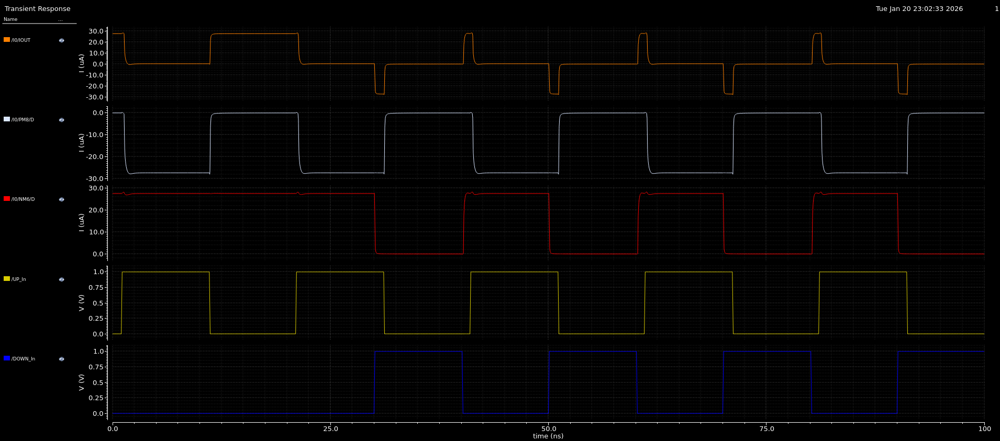

# Charge Pump (CP)

## Overview
This folder contains the design and characterization of a **Current-Steering Charge Pump (CP)** implemented in **45nm CMOS technology**. 

The Charge Pump acts as the interface between the digital PFD and the analog Loop Filter. It converts the `UP` and `DOWN` logic pulses into precise current packets ($I_{cp}$) to charge or discharge the loop filter capacitor, thereby controlling the VCO control voltage ($V_{ctrl}$).

## Circuit Description
The design follows a modular architecture as described in the reference paper attached below. The schematic is divided into five distinct sub-blocks to ensure precise current mirroring and matching:

1.  **Main Bias Mirror**: 
    * The core reference block. It takes the input reference current ($I_{in}$) and generates three internal bias currents ($I_{BIASOut1}$, $I_{BIASOut2}$, and $I_{BIASOut3}$) which feed all other blocks.
2.  **Bias Voltages Circuitry**:
    * Generates the necessary cascode bias voltages ($V_{BiasP}$ and $V_{BiasN}$) for the high-swing output mirrors. 
    * It utilizes $I_{BIASOut1}$ from the Main Bias Mirror to establish stable operating points for the output stage.
3.  **UP and DOWN Current Mirrors (Intermediate Stage)**:
    * These blocks provide isolation and buffering. 
    * The **DOWN Current Mirror** receives $I_{BIASOut3}$ and feeds the Output N Mirror.
    * The **UP Current Mirror** receives $I_{BIASOut2}$ and feeds the Output P Mirror.
4.  **Output Mirrors (P & N)**:
    * The final stage is responsible for driving the loop filter.
    * **Output P Mirror:** Sources the UP current ($I_{UP}$).
    * **Output N Mirror:** Sinks the DOWN current ($I_{DOWN}$).
5.  **Switching Transistors**:
    * Two critical transistors control the activation of the CP.
    * They are driven by the PFD signals ($UP_{IN}$ and $DOWN_{IN}$) to gate the output currents precisely.

## Key Specifications

| Parameter | Value | Notes |
| :--- | :--- | :--- |
| **Technology** | 45nm CMOS | |
| **Supply Voltage** | 1.0 V | |
| **Nominal Current ($I_{cp}$)** | **30 $\mu$A** | Source / Sink |
| **Current Mismatch** | **< 1%** | difference between $I_{up}$ and $I_{down}$ |
| **Output Voltage Range** | 0.2 V to 0.8 V | High impedance region |
| **Topology** | Gate-Switched Cascode | Improved linearity |

## Simulation Results

### 1. Schematic Design
The schematic features a high-swing cascode current mirror structure to maximize output impedance. The logic polarity was tuned to match the PFD:
* **UP Path:** Active High (PMOS Switch).
* **DOWN Path:** Active High (NMOS Switch with Inverter).
* **File:** 

### 2. Up/Down Current Matching
Transient simulation was performed to verify the sourcing and sinking capabilities.
* **UP Pulse:** The CP sources **+28 $\mu$A** when `UP` is high.
* **DOWN Pulse:** The CP sinks **-28 $\mu$A** when `DOWN` is high.
* **Locked State:** When both signals are active (during the PFD reset pulse), the currents cancel each other out perfectly ($\approx 0 \mu A$), preventing ripple on the control voltage.
* **File:** 

## Pin Description
| Pin Name | Type | Description |
| :--- | :--- | :--- |
| **UP_IN** | Input | Control signal from PFD (Sources Current) |
| **DOWN_IN** | Input | Control signal from PFD (Sinks Current) |
| **IOUT** | Output | Current Output to Loop Filter |
| **IBIAS** | Input | Reference Bias Current ($3 \mu A$) |

## References
The Charge Pump architecture and circuit design in this project are based on the following research:

## Notes
- All schematics and layouts are **sanitized**
- No foundry PDK files, device models, or proprietary data are included
- Images are provided for **educational and portfolio purposes only**
- The focus is on **design methodology**, not process-specific optimization

1.  **M. Mestice, G. Ciarpi, D. Rossi, and S. Saponara**, "An Integrated Charge Pump for Phase-Locked Loop Applications in Harsh Environments," *Electronics*, vol. 13, no. 4, p. 744, Feb. 2024. DOI: [10.3390/electronics13040744](https://doi.org/10.3390/electronics13040744)
---
*Part of the 1GHz PLL Design Project.*
