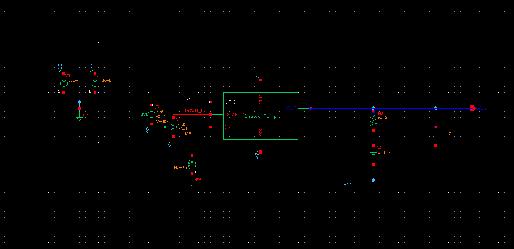
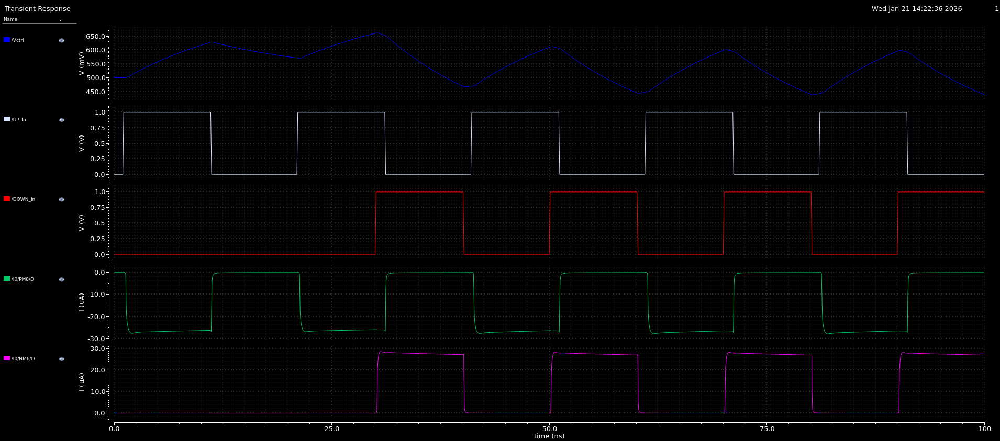

# Loop Filter Design

## 📌 Overview
This directory contains the design and simulation of the **Loop Filter (LF)** for the 1 GHz PLL. The Loop Filter is a critical block that converts the charge pump current pulses ($I_{CP}$) into a stable DC control voltage ($V_{CTRL}$) to drive the Voltage Controlled Oscillator (VCO).

For this PLL, a **2nd-Order Passive Loop Filter** topology was chosen to ensure stability and minimize reference spurs.

---

## ⚙️ Design Specifications
The filter is designed to balance **loop bandwidth**, **settling time**, and **jitter performance**.

| Component | Value | Purpose |
| :--- | :--- | :--- |
| **$R_0$** | **5 kΩ** | Creates a zero in the open-loop transfer function to provide phase margin (damping). |
| **$C_0$** | **15 pF** | Main integrating capacitor; determines the loop bandwidth. |
| **$C_1$** | **1.5 pF** | Secondary capacitor to smooth out high-frequency "ripples" from the Charge Pump switches. |

**Topology:** Series $R_0-C_0$ (Main Branch) in parallel with $C_1$ (Ripple Suppression Branch).

---

## 📸 Schematic
The Loop Filter is integrated with the Charge Pump to form the control voltage generation stage.

*Figure 1: Schematic of the 2nd-Order Passive Loop Filter connected to the Charge Pump output.*

---

## 📊 Simulation Results
The transient simulation demonstrates the filter's ability to integrate the UP/DOWN current pulses into a smooth analog voltage.

* **Input (White/Red):** Digital UP/DOWN pulses from the PFD.
* **Current (Green/Pink):** Charge pump current injection.
* **Output (Blue):** The resulting Control Voltage ($V_{CTRL}$).
    * *Observation:* The filter successfully smooths the discrete charge packets. The residual ripple is minimized by $C_1$, ensuring the VCO does not experience large frequency jumps.

*Figure 2: Transient response showing the generation of Vctrl (Blue) from PFD inputs.*

---

## 📝 Key Features
* **Passive Architecture:** Consumes zero static power (unlike active loop filters).
* **Ripple Suppression:** The ratio $C_0 / C_1 = 10$ was chosen to significantly reduce reference spurs while maintaining loop stability.
* **Damping Optimization:** The resistor $R_0$ was tuned to 10 kΩ to ensure the PLL system is critically damped (preventing ringing during lock acquisition).
