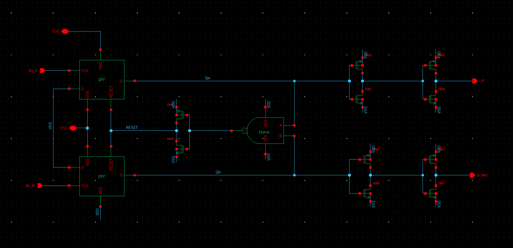
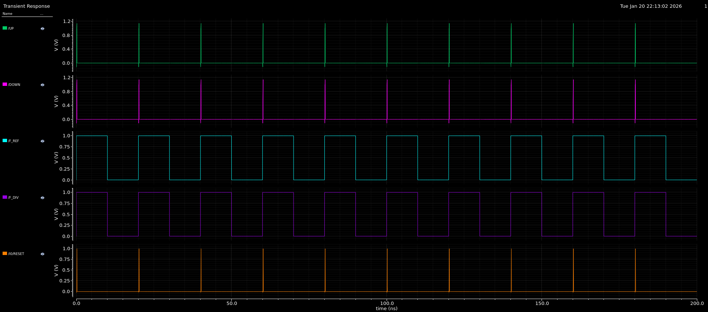
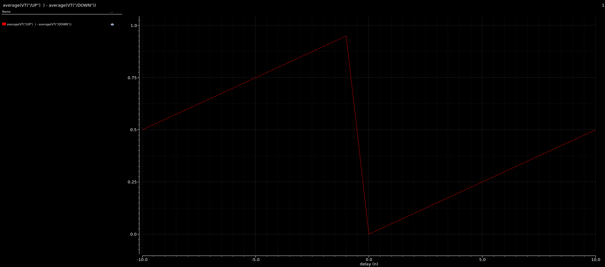
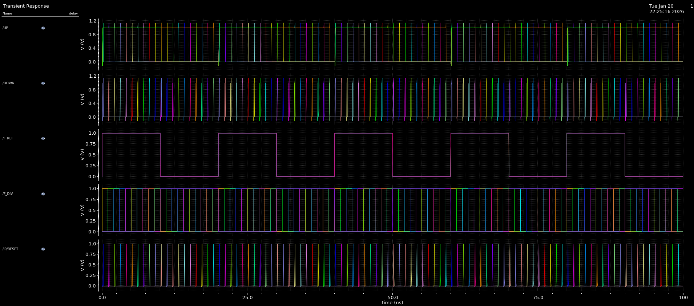

# Phase Frequency Detector (PFD)

## Overview
This folder contains the design and characterization of a **Dead-Zone Free Phase Frequency Detector (PFD)** implemented in **45nm CMOS technology**. 

The PFD is a digital state machine responsible for comparing the Reference Clock ($F_{ref}$) and the Feedback Clock ($F_{div}$). It generates proportional `UP` and `DOWN` control signals that drive the Charge Pump to correct phase and frequency errors. This design features a tuned reset path to eliminate the "Dead Zone"—a common non-linearity near zero phase error that degrades PLL phase noise.

## Key Features
* **Architecture:** Conventional NAND-based topology with active-low reset logic.
* **Dead Zone Elimination:** Engineered internal delay in the reset path ensures both outputs turn on briefly at zero phase error, maintaining loop gain.
* **Linearity:** Excellent linearity across the full $\pm 2\pi$ detection range.
* **Technology:** 45nm CMOS Process.
* **Supply Voltage:** 1.0 V.

## Pin Description
| Pin Name | Type | Description |
| :--- | :--- | :--- |
| **REF** | Input | Reference Clock Input (from Crystal/Source) |
| **DIV** | Input | Feedback Clock Input (from Frequency Divider) |
| **UP** | Output | Charge Pump Control Signal (Active High) |
| **DOWN** | Output | Charge Pump Control Signal (Active High) |
| **RST** | Internal | Reset signal for internal latches |

## Simulation Results

### 1. Schematic Design
The design uses two D-Flip Flops with a feedback AND gate reset logic. Inverters are added to the reset path to create the necessary delay for dead-zone elimination.
* **File:**  

### 2. Dead Zone Characterization
To ensure the PLL does not suffer from "blind spots" when locked, the PFD was simulated with perfectly aligned inputs ($\Delta \Phi = 0$).
* **Observation:** As shown in the plot below, both `UP` and `DOWN` signals assert simultaneously for approximately **150 ps**. This brief overlap turns on both Charge Pump currents, preventing the loop gain from dropping to zero.
* **File:** 

### 3. Phase Error Transfer Curve (Linearity)
A parametric sweep was performed to vary the delay of the `DIV` signal relative to `REF` from $-10 \text{ ns}$ to $+10 \text{ ns}$.
* **Method:** Calculated the difference in average duty cycle: $Duty(UP) - Duty(DOWN)$.
* **Result:** The "Sawtooth" transfer curve confirms linear operation across the entire phase range with no flattening at the origin.
* **File:** 
* 

## Notes
- All schematics and layouts are **sanitized**
- No foundry PDK files, device models, or proprietary data are included
- Images are provided for **educational and portfolio purposes only**
- The focus is on **design methodology**, not process-specific optimization

---

---
*Part of the 1GHz PLL Design Project.*
