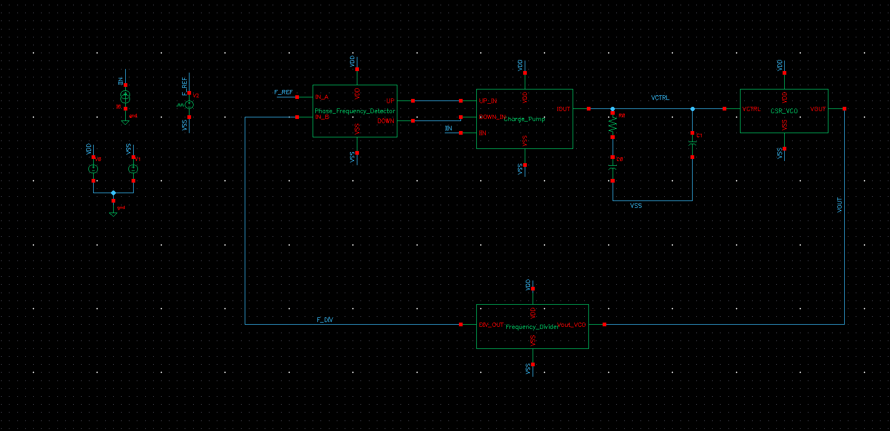

# PLL Top-Level Integration (1 GHz)

## 📌 Overview
This directory contains the **Final Top-Level Integration** of the Phase-Locked Loop. This module connects all previous sub-blocks (PFD, Charge Pump, Loop Filter, VCO, and Frequency Divider) into a single closed-loop system.

The goal of this system is to align the phase and frequency of the **VCO output (1.0 GHz)** with the **Reference Clock (100 MHz)** multiplied by $N=10$.

---

## 🔗 System Architecture
The PLL feedback loop operates as follows:
1.  **PFD:** Compares the Reference Clock (100 MHz) vs. the Feedback Clock (from Divider).
2.  **Charge Pump:** Injects/extracts current based on the phase error.
3.  **Loop Filter:** Integrates the current to generate a smooth control voltage ($V_{CTRL}$).
4.  **VCO:** Adjusts its frequency based on $V_{CTRL}$.
5.  **Divider:** Divides the VCO frequency by 10 to close the loop.

*Figure 1: Top-Level Schematic showing the complete feedback loop.*

---

## 📊 Simulation Results

### **1. Lock Acquisition Process**
The transient simulation below shows the PLL "waking up" and acquiring lock.
* **White Trace ($V_{CTRL}$):** Starts at 0V and ramps up as the PFD detects that the VCO is too slow. It settles and flattens out around **490 mV**, indicating the loop is locked.
* **Blue Trace ($V_{OUT}$):** The VCO output starts oscillating and stabilizes at 1 GHz.

*Figure 2: Transient response of the Control Voltage (White) stabilizing over time.*

### **2. Final Output Waveform**
Zooming in on the stabilized output confirms the frequency accuracy.
* **Measured Frequency:** **999.85 MHz** (Target: 1000 MHz).
* **Error:** $< 0.02\%$.
* **Waveform:** Clean, rail-to-rail clock signal.

*Figure 3: Zoomed-in view of the 1.0 GHz Output Clock after locking.*

---

## 📈 Performance Summary
| Parameter | Target | Simulated Result | Status |
| :--- | :--- | :--- | :--- |
| **Output Frequency** | 1.0 GHz | **999.85 MHz** | ✅ **Pass** |
| **Reference Frequency** | 100 MHz | 100 MHz | ✅ **Pass** |
| **Lock Time** | < 1 $\mu$s | **~400 ns** | ✅ **Pass** |
| **Control Voltage** | - | **488 mV** | ✅ **Centered** |
| **Power Supply** | 1.0 V | 1.0 V | - |

---
## Notes
- All schematics and layouts are **sanitized**
- No foundry PDK files, device models, or proprietary data are included
- Images are provided for **educational and portfolio purposes only**
- The focus is on **design methodology**, not process-specific optimization

