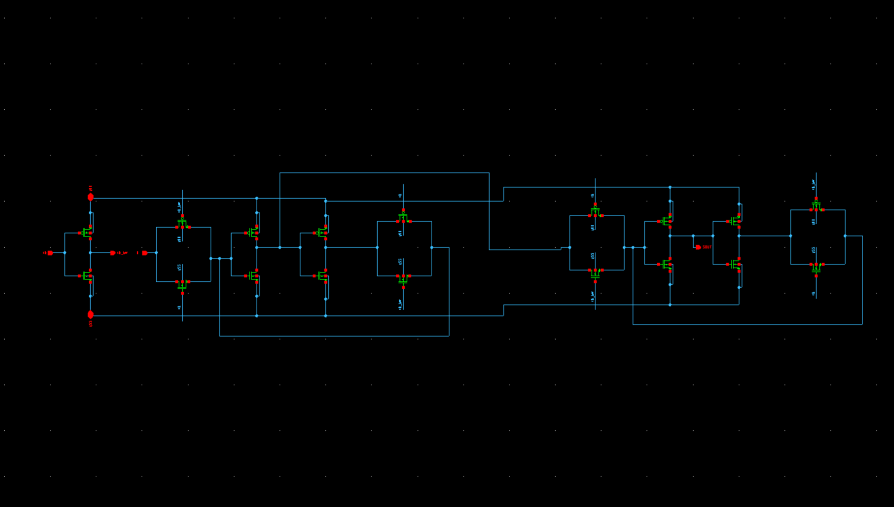
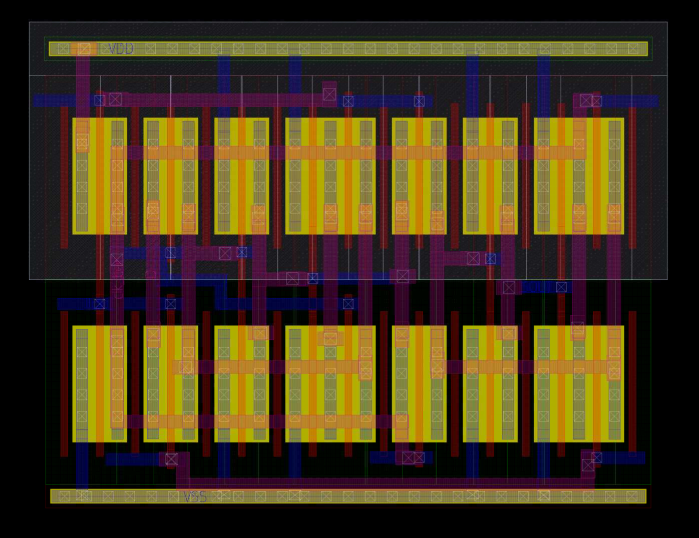
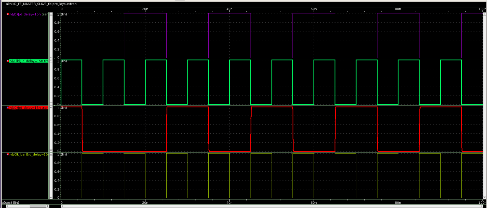
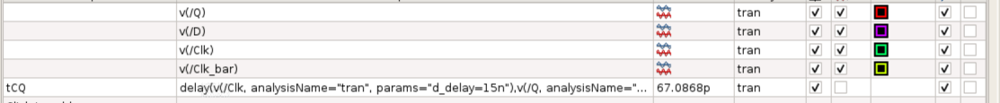
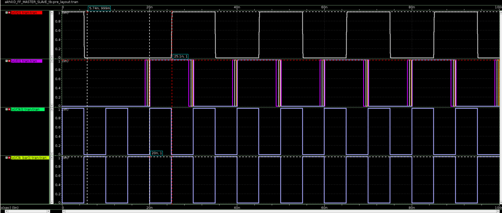
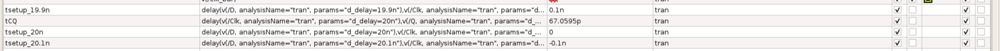
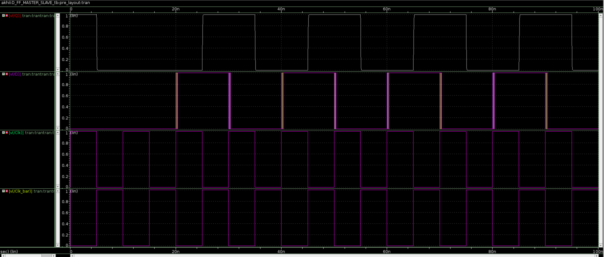

# 28 nm Master–Slave D Flip-Flop (Negative-Edge Triggered)

## Overview
This repository presents the **transistor-level design, layout, and timing characterization**
of a **Master–Slave D Flip-Flop** implemented in **28 nm CMOS technology**.

The flip-flop is a **negative-edge triggered** design, meaning the output **Q** captures
the input **D** on the **falling edge of the clock (CLK)**.

All simulations were performed at **pre-layout (schematic-level)** using  
**Synopsys Custom Compiler** and **PrimeSim**.

---

## Design & Layout

### Schematic
The flip-flop is implemented using a **transmission-gate-based master–slave topology**.
The master latch is transparent when `CLK = 1`, while the slave latch is transparent when
`CLK = 0`, resulting in **edge-triggered behavior** at the clock falling edge.

### Physical Layout
The layout was created using **28 nm CMOS design rules**, following standard cell
layout practices for symmetry, matching, and routability.

---

## Key Specifications

| Parameter | Value |
| :--- | :--- |
| **Technology Node** | 28 nm CMOS |
| **Supply Voltage (VDD)** | 1.0 V |
| **Triggering Edge** | Falling Edge (Negative Edge) |
| **Clocking Scheme** | Differential (`CLK`, `CLK_bar`) |
| **Output Load** | 10 fF |
| **Simulation Type** | Transient (Pre-layout) |

---

## Simulation Environment
- **Tool:** Synopsys PrimeSim (via Custom Compiler)
- **Analysis Type:** Transient (`tran`)
- **Clock Period:** 10 ns (100 MHz)
- **Clock Rise/Fall Time:** 1 ps
- **Temperature:** 25 °C

---

## Timing Characterization Results

All timing measurements are referenced to the **50% VDD (0.5 V)** crossing points.

---

### 1. Clock-to-Q Delay ($t_{CQ}$)

**Definition:**  
Propagation delay from the **falling edge of `CLK`** to the corresponding transition
at output **Q**.

- **Measured Value:** **67.09 ps**
- **Condition:** Negative-edge triggered operation

  
*Waveform illustrating the delay between clock falling edge and Q transition.*

  
*Measurement summary confirming $t_{CQ} \approx 67$ ps.*

---

### 2. Setup Time ($t_{setup}$)

**Definition:**  
The minimum time **before the falling edge of the clock** during which the input **D**
must remain stable to be correctly captured.

- **Verified Margin:** **≈ 100 ps**
- **Observation:** Correct operation is maintained even when data transitions occur
very close to the active clock edge.

  
*Setup-time verification waveform.*

  
*Parametric sweep confirming stable behavior across setup conditions.*

---

### 3. Hold Time ($t_{hold}$)

**Definition:**  
The minimum time **after the falling edge of the clock** during which the input **D**
must remain stable.

- **Verified Margin:** **≈ 200 ps**
- **Result:** Output **Q** remains stable even when **D** toggles shortly after the clock edge.

  
*Hold-time verification waveform.*

---

## Summary of Timing Results

| Metric | Measured Value | Notes |
| :--- | :--- | :--- |
| **$t_{CQ}$** | **67.09 ps** | Fast clock-to-output delay |
| **$t_{setup}$** | **< 100 ps** | Robust setup margin |
| **$t_{hold}$** | **< 200 ps** | Robust hold margin |

---

## Notes
- All figures are **sanitized** and contain **no proprietary PDK information**
- No foundry files, netlists, or rule decks are included
- Results are based on **pre-layout simulations**
- This block is suitable for **standard-cell and custom digital design flows**

---

*Designed and simulated using Synopsys Custom Compiler & PrimeSim.*
